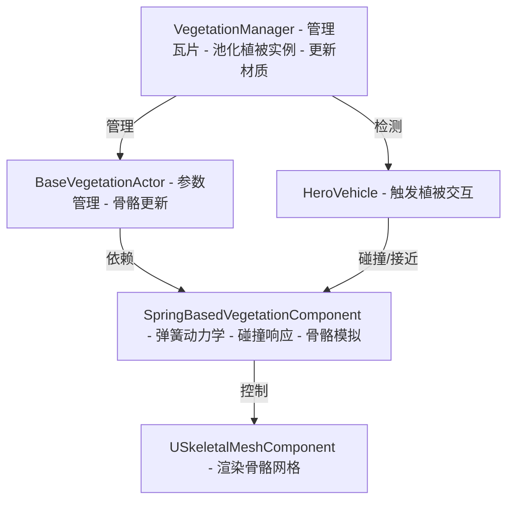

# [植被模块（Vegetation）](#植被模块)


**植被模块（Vegetation）** 是 **CARLA 仿真环境中用于模拟动态植被行为的模块**，负责 **管理植被的生成、物理模拟和动态交互**。该模块基于 **Unreal Engine** 的 Actor 和 Component 系统，结合 **弹簧动力学模型** 实现植被的动态形变和碰撞响应，适用于 **自动驾驶仿真、环境交互、场景渲染** 等场景。

植被模块支持以下功能：
- **动态植被模拟**：通过弹簧动力学模型模拟植被（如树木、灌木）的形变和物理交互。
- **高效植被管理**：基于瓦片（Tile）系统动态加载和卸载植被实例，优化性能。
- **碰撞与交互**：支持植被与车辆等物体的碰撞检测和力反馈。
- **蓝图集成**：通过 Unreal Engine 的蓝图系统支持灵活的植被配置和可视化调试。

该模块适用于 **大规模仿真场景**，如城市环境、乡村道路等，能够在保证视觉真实感的同时维持高性能。

---

## [结构化设计](#结构化设计)

植被模块采用 **模块化设计**，通过 **高内聚、低耦合** 的方式组织代码，确保系统的 **可扩展性** 和 **可维护性**。模块主要由以下组件构成：

- **BaseVegetationActor**：植被的基础 Actor 类，负责管理植被的初始化和参数配置。
- **SpringBasedVegetationComponent**：核心组件，处理植被的骨骼结构、弹簧动力学模拟和碰撞响应。
- **VegetationManager**：管理器类，负责植被实例的动态生成、池化管理和瓦片更新。

这些组件通过 **分层设计** 解耦功能：
- **BaseVegetationActor** 提供参数管理和骨骼更新的接口。
- **SpringBasedVegetationComponent** 实现弹簧动力学和物理计算，独立处理植被的动态行为。
- **VegetationManager** 协调植被的加载、渲染和销毁，优化大规模场景的性能。

这种设计使得植被模块能够 **灵活适配不同类型的植被**（如树木、灌木、草地等），并支持 **动态调整物理参数** 和 **场景优化**。

---

# [架构](#架构)

## [概述](#概述)



该架构图展示了 **VegetationManager**、**BaseVegetationActor**、**SpringBasedVegetationComponent**、**SkeletalMeshComponent** 和 **HeroVehicle** 之间的交互关系。管理器动态加载植被实例，基础 Actor 配置参数，弹簧组件处理物理模拟，骨骼网格负责渲染，车辆触发交互。

## [核心组件](#核心组件)

### [BaseVegetationActor](#basevegetationactor)
- **功能**：植被的基础 Actor，负责初始化、参数管理和骨骼更新。
- **关键方法**：
  - `BeginPlay()`：初始化植被 Actor，调用父类逻辑并记录性能。
  - `GetParametersFromComponent()`：从弹簧组件获取物理参数。
  - `SetParametersToComponent()`：将参数设置到弹簧组件。
  - `UpdateSkeletonAndParameters()`：更新骨骼层次和参数。
- **实现**：通过 `USpringBasedVegetationComponent` 获取和设置物理参数，支持动态调整。使用 `UE_LOG` 记录操作状态，方便调试。

### [SpringBasedVegetationComponent](#springbasedvegetationcomponent)
- **功能**：核心物理模拟组件，基于弹簧动力学模拟植被形变和碰撞。
- **关键方法**：
  - `GenerateSkeletonHierarchy()`：生成骨骼层次结构，定义关节和骨骼关系。
  - `ComputeSpringStrengthForBranches()`：根据参数计算分支弹簧强度。
  - `OnCollisionEvent()`：处理碰撞事件，应用外力。
  - `TickComponent()`：每帧更新物理状态和骨骼变换。
  - `AddForce()`：蓝图可调用，施加外力到指定骨骼。
- **实现**：使用 Eigen 库进行矩阵运算，结合 Unreal Engine 的骨骼网格实现动态形变。支持碰撞胶囊（`BoneCapsules`）和调试可视化。

### [VegetationManager](#vegetationmanager)
- **功能**：管理植被的动态生成、池化和瓦片更新。
- **关键方法**：
  - `SpawnSkeletalFoliages()`：根据瓦片数据生成植被实例。
  - `DestroySkeletalFoliages()`：销毁远离车辆的植被。
  - `UpdateMaterials()`：更新植被材质，优化渲染。
  - `CreatePoolForBPClass()`：创建植被对象池，减少实例化开销。
  - `Tick()`：每帧更新瓦片和植被状态。
- **实现**：基于瓦片系统（`TileCache`）和对象池（`ActorPool`）优化性能，支持大规模场景。使用 `HeroVehicle` 的位置动态管理植被。

## [事件驱动](#事件驱动)

植被模块采用 **事件驱动模型**，通过 Unreal Engine 的事件系统处理植被的交互和更新：

1. **碰撞事件**：
   - `SpringBasedVegetationComponent::OnCollisionEvent` 响应车辆等物体与植被的碰撞，基于 `FHitResult` 计算外力并更新骨骼状态。
   - 示例：当车辆撞击树木时，触发形变并应用力。

2. **重叠事件**：
   - `OnBeginOverlapEvent` 和 `OnEndOverlapEvent` 检测物体进入或离开植被范围，调整碰撞胶囊的物理模拟。
   - 示例：车辆靠近灌木时，触发物理计算。

3. **世界事件**：
   - `VegetationManager::OnLevelAddedToWorld` 和 `OnLevelRemovedFromWorld` 响应瓦片加载/卸载，更新 `TileCache` 和 `FoliageBlueprintCache`。
   - 示例：新地图瓦片加载时，初始化植被数据。

4. **每帧更新**：
   - `SpringBasedVegetationComponent::TickComponent` 更新骨骼变换和物理状态。
   - `VegetationManager::Tick` 检查车辆位置，更新瓦片和植被实例。

## [物理模拟](#物理模拟)

`SpringBasedVegetationComponent` 实现基于弹簧动力学的物理模拟：
- **骨骼层次**：通过 `SkeletonHierarchy` 管理关节（`SkeletonJoint`）和骨骼（`SkeletonBone`），支持多层分支结构。
- **弹簧模型**：使用 `SpringStrength`、`Beta`（阻尼系数）、`Alpha`（刚度）等参数模拟形变。
- **碰撞响应**：通过 `CapsuleRadius` 和 `LineTraceMaxDistance` 定义碰撞胶囊，检测与车辆等的交互，应用外力（`ExternalForces`）。
- **优化**：使用 Eigen 库进行高效矩阵运算（如惯性张量 `InertiaTensor` 和变换矩阵 `JointToGlobalMatrix`），支持复杂动力学计算。
- **关键实现**：
  - `ComputePerJointProperties`：计算关节的物理属性（如质量、角速度）。
  - `SolveEquationOfMotion`：求解运动方程，更新关节状态。
  - `ResolveContactsAndCollisions`：处理碰撞和接触力。

## [缓存管理](#缓存管理)

- **对象池**：`VegetationManager::ActorPool` 缓存植被实例（`PooledActor`），通过 `EnableActor` 和 `DisableActor` 复用 Actor，减少创建/销毁开销。
- **瓦片缓存**：`TileCache` 存储瓦片数据（`TileData`），包括 `InstancedFoliageActor` 和 `ProceduralFoliageVolume`，动态加载靠近车辆的植被。
- **材质缓存**：`MaterialInstanceDynamicCache` 缓存动态材质，优化渲染性能，通过 `UpdateMaterialCache` 更新材质参数（如透明度、调试状态）。
- **关键实现**：
  - `CreateOrUpdateTileCache`：初始化或更新瓦片数据。
  - `FreeTileCache`：释放不再使用的瓦片。
  - `SetMaterialCache`：为瓦片中的静态网格设置动态材质。

## [优化机制](#优化机制)

- **动态加载**：通过 `GetTilesInUse` 检查车辆所在瓦片，仅加载附近植被，减少内存占用。
- **对象池化**：`CreatePoolForBPClass` 创建预分配的植被池，`EnableActorFromPool` 复用实例。
- **碰撞优化**：仅对靠近车辆的植被（`ActiveActorDistance` 内）启用碰撞检测，降低计算开销。
- **性能分析**：使用 `TRACE_CPUPROFILER_EVENT_SCOPE` 标记关键函数，优化 CPU 使用。

## [配置管理](#配置管理)

### [概述](#概述-配置管理)

植被模块依赖 Unreal Engine 的组件系统和 CARLA 的工具集，支持灵活的配置，包括物理参数、对象池大小和瓦片管理。

### [环境要求](#环境要求)

- **Unreal Engine**：版本 4.26 或以上。
- **Eigen**：用于矩阵运算。
- **CARLA**：植被模块集成于 CARLA 仿真环境。

安装 Eigen（Ubuntu 示例）：
```bash
sudo apt-get install libeigen3-dev
```

### [配置项](#配置项)

#### [弹簧参数](#弹簧参数)
在 `SpringBasedVegetationComponent` 中配置：
```cpp
SpringComponent->Beta = 0.5f; // 阻尼系数
SpringComponent->BaseSpringStrength = 10000.f; // 基础弹簧强度
SpringComponent->MinSpringStrength = 2000.f; // 最小弹簧强度
SpringComponent->Gravity = FVector(0, 0, -1); // 重力
SpringComponent->CapsuleRadius = 6.0f; // 碰撞胶囊半径
SpringComponent->LineTraceMaxDistance = 180.f; // 碰撞检测距离
```

#### [植被管理](#植被管理)
在 `VegetationManager` 中配置：
```cpp
VegetationManager->SpawnScale = 1.0f; // 植被缩放比例
VegetationManager->ActiveActorDistance = 500.f; // 激活植被的距离
VegetationManager->InitialPoolSize = 50; // 初始对象池大小
VegetationManager->DebugMaterials = false; // 是否启用材质调试
```

#### [调试参数](#调试参数)
```cpp
SpringComponent->DebugEnableVisualization = true; // 启用骨骼和碰撞可视化
SpringComponent->DebugEnableAllCollisions = true; // 启用所有碰撞检测
```

### [示例配置](#示例配置)

#### [配置弹簧组件](#配置弹簧组件)
```cpp
#include "Carla/Vegetation/SpringBasedVegetationComponent.h"

void ConfigureSpringComponent(SpringBasedVegetationComponent* SpringComponent) {
    SpringComponent->Beta = 0.7f;
    SpringComponent->BaseSpringStrength =  prioritize readability and clarity.

12000.f;
    SpringComponent->Gravity = FVector(0, 0, -9.8f);
    SpringComponent->bAutoComputeStrength = true;
    SpringComponent->GenerateSkeletonHierarchy();
    SpringComponent->ComputeSpringStrengthForBranches();
}
```

#### [配置植被管理器](#配置植被管理器)
```cpp
#include "Carla/Vegetation/VegetationManager.h"

void ConfigureVegetationManager(VegetationManager* Manager) {
    Manager->SpawnScale = 1.2f;
    Manager->ActiveActorDistance = 600.f;
    Manager->InitialPoolSize = 100;
    Manager->DebugMaterials = true;
}
```

### [总结](#总结-配置管理)

- 提供 **灵活的物理参数配置**，支持动态调整植被行为。
- **对象池和瓦片管理** 优化大规模场景性能。
- **调试工具** 便于开发和测试，确保模块稳定性。

---

# [使用植被模块](#使用-植被模块)

## [数据输入与输出](#数据输入与输出)

植被模块主要处理以下数据：
- **输入**：车辆位置（`HeroVehicle`）、瓦片数据（`TileCache`）、蓝图配置（`FoliageBlueprint`）。
- **输出**：动态植被实例（`BaseVegetationActor`）、骨骼变换（`SkeletalMeshComponent`）、碰撞响应。

| **主题**           | **描述**                                                 |
|-------------------|--------------------------------------------------------|
| **骨骼层次**       | 定义植被的关节和骨骼结构，支持动态形变。                   |
| **弹簧参数**       | 控制植被的物理行为，如阻尼、刚度和重力。                   |
| **瓦片数据**       | 管理场景中的植被分布，动态加载/卸载。                     |

### 示例代码
```cpp
#include "Carla/Vegetation/BaseVegetationActor.h"

void CreateVegetation(BaseVegetationActor* VegetationActor) {
    VegetationActor->UpdateSkeletonAndParameters();
    SpringBasedVegetationComponent* SpringComponent = VegetationActor->FindComponentByClass<SpringBasedVegetationComponent>();
    SpringComponent->AddForce("joint1", FVector(100, 0, 0));
}
```

## [创建植被实例](#创建植被实例)

植被实例由 `BaseVegetationActor` 和 `SpringBasedVegetationComponent` 组成。

### 服务器端（VegetationManager）
```cpp
#include "Carla/Vegetation/VegetationManager.h"

void SetupVegetationManager(VegetationManager* Manager, CarlaWheeledVehicle* Vehicle) {
    Manager->AddVehicle(Vehicle);
    Manager->CreatePoolForBPClass(FoliageBlueprint);
}
```

### 客户端（BaseVegetationActor）
```cpp
#include "Carla/Vegetation/BaseVegetationActor.h"

void SetupVegetationActor(BaseVegetationActor* VegetationActor) {
    VegetationActor->UpdateSkeletonAndParameters();
}
```

## [配置植被任务](#配置植被任务)

支持 **同步模式** 和 **异步模式**，可调整物理模拟和植被管理的方式。

| **主题**      | **描述**                                       |
|--------------|--------------------------------------------|
| **同步模式**  | 每帧阻塞式更新，适合小型场景。                   |
| **异步模式**  | 使用对象池和瓦片系统异步加载，适合大规模场景。   |

### 同步模式
```cpp
VegetationManager->Tick(DeltaTime);
```

### 异步模式
```cpp
VegetationManager->ActivePooledActors();
```

### 配置碰撞
```cpp
SpringComponent->CollisionForceParameter = 15.f;
SpringComponent->ForceMaxDistance = 200.f;
```

## [停止植被模块](#停止-植被模块)

- **销毁植被**：
  ```cpp
  VegetationManager->DestroySkeletalFoliages();
  ```
- **禁用组件**：
  ```cpp
  SpringComponent->SetComponentTickEnabled(false);
  ```
- **释放瓦片**：
  ```cpp
  VegetationManager->FreeTileCache(Level);
  ```

**注意**：
- 关闭植被模块后，未销毁的 Actor 可能仍占用内存，需手动清理。
- 使用 `DebugEnableVisualization` 检查物理状态，确保无异常。

---

# [运行模式](#运行模式)

## [植被管理器与植被实例](#植被管理器与植被实例)

### 概述
植被模块采用 **管理器-实例** 架构，`VegetationManager` 负责全局管理和优化，`BaseVegetationActor` 处理单个植被的物理模拟。

### 管理器（AVegetationManager）
- **功能**：动态加载瓦片、池化植被、更新材质。
- **代码解析**：
  ```cpp
  void VegetationManager::Tick(float DeltaTime) {
      Super::Tick(DeltaTime);
      if (!LargeMap) return;
      HeroVehicle = LargeMap->GetHeroVehicle();
      TArray<FString> TilesInUse = GetTilesInUse();
      for (const FString& TileName : TilesInUse) {
          FTileData* Tile = TileCache.Find(TileName);
          UpdateMaterials(Tile);
          TArray<FElementsToSpawn> ElementsToSpawn = GetElementsToSpawn(Tile);
          SpawnSkeletalFoliages(ElementsToSpawn);
          ActivePooledActors();
          DestroySkeletalFoliages();
      }
  }
  ```

### 实例（BaseVegetationActor）
- **功能**：管理单个植被的参数和骨骼。
- **代码解析**：
  ```cpp
  void BaseVegetationActor::UpdateSkeletonAndParameters() {
      SpringBasedVegetationComponent* SpringComponent = Cast<USpringBasedVegetationComponent>(
          GetComponentByClass(USpringBasedVegetationComponent::StaticClass()));
      if (!SpringComponent) {
          UE_LOG(LogCarla, Error, TEXT("Component not found"));
          return;
      }
      SetParametersToComponent();
      SpringComponent->GenerateSkeletonHierarchy();
      SpringComponent->ComputeSpringStrengthForBranches();
      GetParametersFromComponent();
  }
  ```

## [多植被并发](#多植被并发)

- **概述**：支持多个植被实例同时运行，通过对象池（`ActorPool`）管理并发。
- **代码解析**：
  ```cpp
  void VegetationManager::SpawnSkeletalFoliages(Array<ElementsToSpawn>& ElementsToSpawn) {
      for (ElementsToSpawn& Element : ElementsToSpawn) {
          TArray<FPooledActor>* Pool = ActorPool.Find(Element.BP.BPFullClassName);
          for (const Pair<Transform, int32>& TransformIndex : Element.TransformIndex) {
              EnableActorFromPool(TransformIndex.Key, TransformIndex.Value, Element.TileMeshComponent, *Pool);
          }
      }
  }
  ```

## [多瓦片支持](#多瓦片支持)

- **概述**：基于 `TileCache` 管理多个瓦片，动态加载靠近车辆的植被。
- **代码解析**：
  ```cpp
  void VegetationManager::CreateOrUpdateTileCache(ULevel* InLevel) {
      TileData TileData {};
      for (AActor* Actor : InLevel->Actors) {
          InstancedFoliageActor* InstancedFoliageActor = Cast<InstancedFoliageActor>(Actor);
          if (IsValid(InstancedFoliageActor)) {
              TileData.InstancedFoliageActor = InstancedFoliageActor;
              break;
          }
      }
      if (!IsValid(TileData.InstancedFoliageActor)) return;

      for (Actor* Actor : InLevel->Actors) {
          ProceduralFoliageVolume* ProceduralFoliageVolume = Cast<ProceduralFoliageVolume>(Actor);
          if (IsValid(ProceduralFoliageVolume)) {
              TileData.ProceduralFoliageVolume = ProceduralFoliageVolume;
              break;
          }
      }
      if (!IsValid(TileData.ProceduralFoliageVolume)) return;

      const String TileName = TileData.InstancedFoliageActor->GetLevel()->GetOuter()->GetName();
      TileData* ExistingTileData = TileCache.Find(TileName);
      if (ExistingTileData) {
          ExistingTileData->InstancedFoliageActor = TileData.InstancedFoliageActor;
          ExistingTileData->ProceduralFoliageVolume = TileData.ProceduralFoliageVolume;
          ExistingTileData->TileMeshesCache.Empty();
          ExistingTileData->MaterialInstanceDynamicCache.Empty();
          SetTileDataInternals(*ExistingTileData);
      } else {
          SetTileDataInternals(TileData);
          TileCache.Emplace(TileName, TileData);
      }
  }
  ```

---

# [其他模式](#其他模式)

## [调试模式](#调试模式)

- **描述**：启用可视化调试，显示碰撞胶囊、骨骼层次和物理状态，便于开发和测试。
- **实现**：
  ```cpp
  SpringComponent->DebugEnableVisualization = true; // 启用骨骼和碰撞胶囊可视化
  SpringComponent->DebugEnableAllCollisions = true; // 启用所有碰撞检测
  VegetationManager->DebugMaterials = true; // 启用材质调试
  ```
- **应用场景**：用于检查植被的物理行为是否符合预期，特别是在碰撞或形变异常时。

## [蓝图集成](#蓝图集成)

- **描述**：通过 Unreal Engine 的蓝图系统配置植被参数和触发交互，支持快速原型开发。
- **实现**：
  ```cpp
  // 蓝图调用示例：施加外力到指定骨骼
  UFUNCTION(BlueprintCallable)
  void AddForce(const FString& BoneName, const FVector& Force) {
      Skeleton.AddForce(BoneName, Force);
  }
  ```
- **应用场景**：在蓝图中动态调整 `Beta`、`SpringStrength` 等参数，或触发植被交互。

## [大规模场景优化](#大规模场景优化)

- **描述**：通过瓦片管理和对象池化，优化大规模场景的性能。
- **实现**：
  - **瓦片动态加载**：`GetTilesInUse()` 仅加载车辆附近的瓦片。
  - **对象池复用**：`EnableActorFromPool()` 复用植被实例。
  - **材质优化**：`UpdateMaterialCache()` 动态调整材质参数。
- **应用场景**：适用于城市或乡村等复杂仿真环境，确保高帧率。

---
